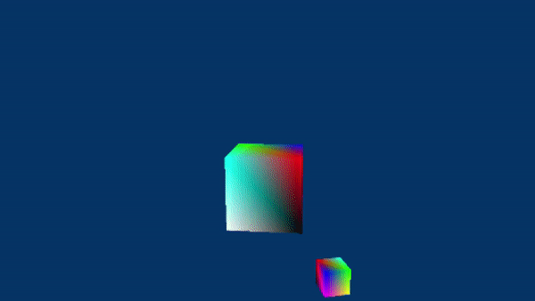

# LearnDirectX-Tutorial
## Description
Repository for [Learn DirectX](https://www.learndirectx.net/)  

If you are looking for a comprehensive, updated resource to learn how to program with DirectX 12 from scratch, then give the following tutorial series a chance:  
[Learn DirectX](https://www.learndirectx.net/)  

If you prefer dark themes, take a look at the wiki (WIP).  

 

## Samples
### [01.G-D3D12HelloTransformations](https://github.com/PAMinerva/LearnDirectX-Samples/tree/master/01G-D3D12HelloTransformations)
<!---
   
-->
     

## Credits
* https://github.com/microsoft/DirectX-Graphics-Samples  
* https://github.com/microsoft/Xbox-ATG-Samples  
* https://github.com/walbourn
